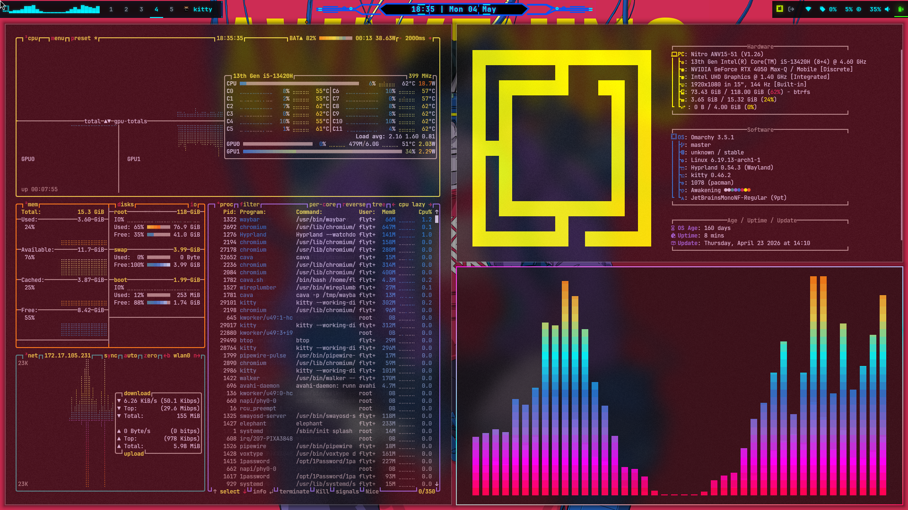

# waybar-config

Custom Cyberpunk inspired Waybar configuration for Hyprland and Omarchy. The layout is split into left, center, and right sections with custom scripts and themed assets.

## Features

- Left side Omarchy launcher, Cava visualizer, Hyprland workspaces, and active window title
- Center time and date display with a compact format
- Right side update indicators, tray drawer, network, GPU, CPU, audio, and battery status
- Optional weather module driven by wttrbar
- Custom scripts for GPU usage, network speed, compact mode, window title, and Cava output
- Themed assets for separators and clock background

## Modules and layout

- Core config in `config.jsonc`
- Layout in `modules/layout.jsonc`
- Hyprland modules in `modules/hyprland.jsonc`
- System modules in `modules/system.jsonc`
- Custom modules in `modules/custom.jsonc`
- Weather module in `modules/custom-weather.jsonc`

## Requirements

- waybar
- hyprland
- omarchy commands in PATH
- nerd font with required glyphs
- cava
- wttrbar (for weather)
- wiremix or an audio mixer compatible with the commands
- impala (network manager TUI)

## Scripts

Custom scripts live in the repo root and `scripts/`. Update paths if you move them.

- `cava.sh`
- `net_speed.sh`
- `waybar-gpu.sh`
- `window.sh`
- `scripts/workspace-button.sh`
- `scripts/compact-toggle.sh`
- `scripts/compact-toggle-switch.sh`

## Usage

1. Copy this folder to `~/.config/waybar`
2. Restart waybar: `omarchy-restart-waybar`

## Screenshot

Add a screenshot at `assets/screenshot.png` and update this section if you prefer a different path.

